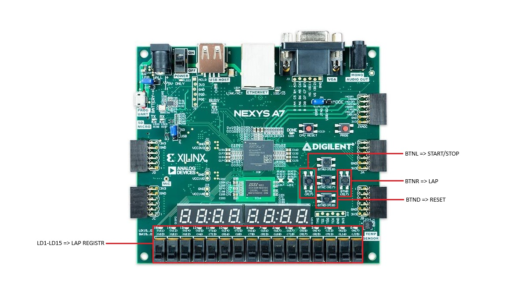
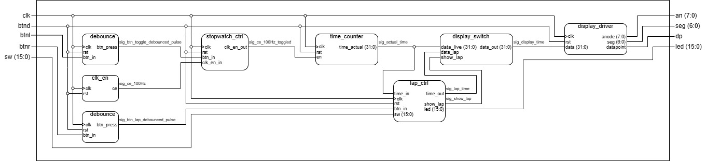

# Semestrální projekt z předmětu BPC-DE1 - VHDL StopWatch (lap)

Tento repozitář obsahuje semestrální projekt do předmětu Digitální elektronika 1 (BPC-DE1). Cílem projektu bylo navrhnout a implementovat plně funkční **digitální stopky s funkcí ukládání mezičasů (LAP)**. Design je napsán v jazyce **VHDL**, testován pomocí simulací v prostředí **Vivado** a určen pro nasazení na vývojovou desku **Nexys A7-50T**.

### Členové týmu:
- Matěj Berger (270764)
- Tomáš Nosek (270975)
- Eduard Josefík (259025)

## Vlastnosti návrhu
* Měření času s přesností na **setiny sekundy** ve formátu `HH:MM:SS:XX`.
* Nezávislé běžící stopky na pozadí i během prohlížení paměti.
* Paměť pro 16 mezičasů.
* Vizuální odezva stavu paměti pomocí soustavy LED diod (svícení = uloženo, blikání = zobrazeno).

## Princip ovládání:

| **Prvek** | **Akce** | **Popis funkce** |
| :--- | :--- | :--- |
| **`BTNL`** | **Start / Stop** | Slouží k zapnutí a pozastavení běžících stopek. |
| **`BTND`** | **Reset** | Provede celkový reset stopek i paměti mezičasů (vymaže všechny uložené sloty). |
| **`BTNR`** | **Lap (Uložit)** | Uloží aktuální čas na displeji do nejbližšího volného slotu v paměti. |
| **`SW(15:0)`** | **Zobrazit mezičas** | Fyzické přepínače zleva doprava (SW15 až SW0). Zvednutím přepínače se na displeji objeví čas z příslušného slotu paměti. |
| **`LED(15:0)`**| **Stav paměti** | Indikátory stavu. Nesvítí = prázdno. Trvale svítí = čas je uložen. Bliká = čas je aktuálně zobrazen na displeji. |

### <ins>"Návod" k použití</ins>:
1. **Měření:** Stisknutím tlačítka Start/Stop (`BTNL`) se stopky spustí a na 7segmentovém displeji se začne odpočítávat čas (od setin sekundy až po desítky hodin).
2. **Ukládání mezičasů (LAP):** Během měření lze stisknout tlačítko LAP (`BTNR`). Systém aktuální čas uloží do interní paměti a **rozsvítí první LED diodu zcela vlevo**. Při dalším stisku se čas uloží do dalšího slotu a rozsvítí se druhá LED dioda. Interní stopky při ukládání neustále běží a měří čas.
3. **Prohlížení paměti:** Pokud chce uživatel vidět uložený čas, zvedne příslušný přepínač (`SW`). Jakmile je přepínač zvednutý:
   * Na displeji se zobrazí  uložený mezičas (stopky na pozadí stále běží).
   * Příslušná LED dioda nad zvednutým přepínačem **začne blikat**, čímž indikuje, na který slot se uživatel právě dívá.
4. **Priorita a zaplnění:** 
   * Zařízení má paměť pro 16 časů (plní se zleva doprava). Pokud uživatel stiskne tlačítko LAP po sedmnácté, systém ignoruje příkaz ignoruje
   * Pokud uživatel zvedne více přepínačů naráz, systém obsahuje prioritní enkodér, který vždy **vybere a zobrazí přepínač nejvíce vlevo**.

## Struktura projektu:

Top-level design [`stopwatch_top`](/Vivado%20Project/DE1-Project-Stopwatch_VivadoProject/DE1-Project-Stopwatch_VivadoProject.srcs/sources_1/new/stopwatch_top.vhd) se skládá z instanciace následujících hlavních VHDL komponent:

* **[`stopwatch_ctrl`](docs/stopwatch_ctrl.md): Řídicí jednotka stopek.**
  Zpracovává stisky tlačítek pro Start/Stop a na jejich základě propouští (nebo blokuje) hodinové povolovací pulzy do hlavního čítače času.
* **[`time_counter`](docs/time_counter.md): Hlavní čítač času.**
  Kaskádově zapojený BCD čítač. Počítá čas od setin sekundy a přelévá hodnoty až do desítek hodin. Výstupem je 32bitový vektor pro displej.
* **[`lap_ctrl`](docs/lap_ctrl.md): Správce paměti a uživatelského rozhraní.**
  Komplexní blok tvořený saturační pamětí (16x32 bitů), prioritním enkodérem pro vyhledávání aktivních přepínačů a stavovým automatem pro řízení (blikání/svícení) LED diod.
* **[`display_ctrl`](docs/display_ctrl.md): Datový multiplexer ("výhybka").**
  Komponenta, která na základě řídicího signálu plynule přepíná výstup na displej mezi "živým" časem a statickým "mezičasem" z paměti.
* **[`display_driver2`](docs/display_driver.md): Budič 7segmentového displeje.**
  Zajišťuje časový multiplex (velmi rychlé přepínání) pro obsluhu všech osmi číslic na desce tak, aby lidské oko vnímalo obraz jako souvislý. Využívá bin2seg dekodér z počítačových cvičení.

Mimo tyto jsou jsou použity i komponenty `clk_en` a `debounce`, které byly vytvořeny během průběhu semestru v počítačových cvičeních.
### Top-level schéma:

## Resource Utilization

| Typ zdroje (Resource) | Využito (Utilization) | K dispozici (Available) | Využití v % |
| :--- | :---: | :---: | :---: |
| **LUT** (Look-Up Tables) | 432 | 32 600 | 1.33 % |
| **FF** (Flip-Flops) | 633 | 65 200 | 0.97 % |
| **IO** (Input/Output Pins) | 52 | 210 | 24.76 % |
| **BUFG** (Global Buffers) | 1 | 32 | 3.13 % | 

