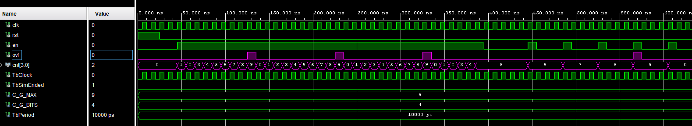

# Komponenta: `counter2_bcd`

Tato komponenta je univerzální synchronní čítač s nastavitelnou maximální hodnotou, který vychází ze základní verze vytvořené během laboratorních cvičení. Byla vylepšena tak, aby kromě definice bitové šířky výstupu umožňovala přesně nastavit i horní hranici počítání, po jejímž dosažení generuje signál přetečení.

## Vstupy a Výstupy

| Port | Směr | Typ | Popis |
| :--- | :---: | :--- | :--- |
| **`clk`** | `in` | `STD_LOGIC` | Hlavní hodinový signál (Clock). |
| **`rst`** | `in` | `STD_LOGIC` | Synchronní reset. Pokud je aktivní ('1'), vynuluje čítač na hodnotu 0. |
| **`en`** | `in` | `STD_LOGIC` | Povolovací signál (Enable). Čítač inkrementuje svou hodnotu pouze tehdy, je-li `en` v logické '1'. |
| **`cnt`** | `out` | `STD_LOGIC_VECTOR(G_BITS - 1 downto 0)` | Aktuální hodnota čítače jako logický vektor. |
| **`ovf`** | `out` | `STD_LOGIC` | Signál přetečení (Overflow). Je aktivní ('1') právě jeden hodinový takt, když čítač dosáhne své maximální hodnoty a zároveň je povolen (`en = '1'`). |

### Genericy

*   **`G_BITS`**: Definuje bitovou šířku výstupního vektoru `cnt` (výchozí hodnota je 4).
*   **`G_MAX`**: Nastavuje maximální hodnotu, do které čítač počítá, než se vrátí na nulu (výchozí hodnota je 4).

## Princip fungování

[Zdrojový kód komponenty](../Vivado%20Project/DE1-Project-Stopwatch_VivadoProject/DE1-Project-Stopwatch_VivadoProject.srcs/sources_1/new/counter2_bcd.vhd)

Jádrem komponenty je synchronní proces, který na každou vzestupnou hranu hodinového signálu `clk` vyhodnocuje stav řídicích vstupů. 

Pokud není aktivní reset (`rst = '0'`) a je povolen běh (`en = '1'`), čítač se podívá na svou aktuální interní hodnotu (`sig_cnt`). Pokud je tato hodnota menší než definované maximum `G_MAX`, čítač ji zvýší o jedničku. Pokud interní hodnota dosáhla `G_MAX`, čítač se v následujícím hodinovém taktu "přetočí" a vynuluje se zpět na nulu.

Aby bylo možné tyto čítače snadno řetězit (zapojovat do kaskády, jako to dělá například komponenta `time_counter`), je implementován výstup `ovf`. Tento signál funguje jako "enable" pro následující vyšší řád a vygeneruje impulz v momentě, kdy je aktuální čítač na své maximální hodnotě a chystá se přetočit.

## Simulace (Testbench)
[Zdrojový kód testbenche](../Vivado%20Project/DE1-Project-Stopwatch_VivadoProject/DE1-Project-Stopwatch_VivadoProject.srcs/sim_1/new/counter2_bcd_tb.vhd)

Testbench (`counter2_bcd_tb`) instancuje čítač s parametry nastavenými pro počítání do 9 (klasické BCD, `G_MAX = 9`, `G_BITS = 4`). Testuje následující **požadované funkce:**

1. **Test resetu:** Aktivace synchronního resetu (`rst = '1'`) vynuluje čítač bez ohledu na ostatní signály.
2. **Test počítání a přetečení:** Signál `en` je trvale sepnut (`en = '1'`) a čítač běží nepřetržitě. Ověřuje se, že po dosažení hodnoty 9 se správně vynuluje na 0 a že přesně v okamžiku, kdy je hodnota 9, generuje krátký pulz na výstupu `ovf`.
3. **Test pozastavení (Enable):** Signál `en` se přepne do stavu '0'. Testbench ověřuje, že čítač okamžitě přestane počítat a udrží si svou poslední (zamrznutou) hodnotu, i když hodinové impulzy stále přicházejí.
4. **Test kaskádového buzení (Enable pulzy):** Namísto trvalého zapnutí vstupního `en` signálu jsou simulovány krátké pulzy z předchozího stupně (např. obdoba funkce `clk_en`). Ověřuje se schopnost čítače inkrementovat přesně o jedna při každém pulzu na vstupu `en`.

*(Obrázek: Průběh signálů ze simulace testbenche ukazující inkrementaci, zamrznutí hodnoty a generování signálu přetečení ovf)*