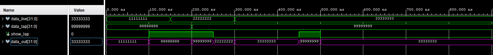

# Komponenta: `Display_ctrl`
Volí, zda se bude zobrazovat aktuální čas, nebo čas uložený v požadovaném registru

| **Port** | **Směr** | **Typ** | **Popis** |
| :-: | :-: | :-- | :-- |
| `data_live` | in  | `std_logic_vector(31 down to 0)` | Vstup aktuálního času z time_counteru |
| `data_lap` | in  | `std_logic` | Vstup času uložený v 32 bitech z lap_ctrl |
| `show_lap` | in  | `std_logic` | Pokud show_lap '1' zobrazí uložený čas |
| `data_out` | out | `std_logic_vector(31 down to 0)` | Výstup zvoleného času do display_driveru |

## Princip fungování
[Zdrojový kód komponenty](../Vivado%20Project/DE1-Project-Stopwatch_VivadoProject/DE1-Project-Stopwatch_VivadoProject.srcs/sources_1/new/display_ctrl.vhd)
Komponenta plní funkci datového multiplexeru. Její chování je plně podřízeno stavu řídicího signálu `show_lap`:

* **Zobrazení aktuálního času (`show_lap = '0'`):** Na výstup `data_out` je plynule propouštěn signál ze vstupu `data_live`. Displej tak reaguje na každou změnu běžících stopek.
* **Zobrazení uloženého mezičasu (`show_lap = '1'`):** Komponenta okamžitě přepne zdroj dat a na výstup začne směrovat statická data ze vstupu `data_lap`. 

## Simulace (testbench)
[Zdrojový kód testbenche](../Vivado%20Project/DE1-Project-Stopwatch_VivadoProject/DE1-Project-Stopwatch_VivadoProject.srcs/sim_1/new/stopwatch_ctrl_tb.vhd)

Testbench (`display_ctrl_tb`) testuje následující **požadované funkce:**

1. **Test zobrazení běžícího času:** Kontroluje se výchozí stav, kdy je `show_lap` nastaveno na '0'. Výstup musí přesně kopírovat hodnotu na vstupu `data_live`.
2. **Test zobrazení mezičasu:** Signál `show_lap` se přepne na '1'. Výstup se musí okamžitě změnit a zobrazovat hodnotu ze vstupu `data_lap`.
3. **Test běhu stopek na pozadí:** Zatímco je zobrazen mezičas (`show_lap = '1'`), testbench změní hodnotu `data_live` (simuluje běžící stopky). Ověřuje se, že tato změna nijak neovlivní výstup a na displeji zůstává "zamrznutý" mezičas.
4. **Test změny mezičasu a návratu:** Změní se vstupní data mezičasu (simuluje přepnutí uživatele na jinou paměťovou pozici), což se musí ihned promítnout na výstupu. Následně se `show_lap` přepne zpět na '0', čímž se výstup úspěšně vrátí k zobrazení aktuálního běžícího času stopek.

