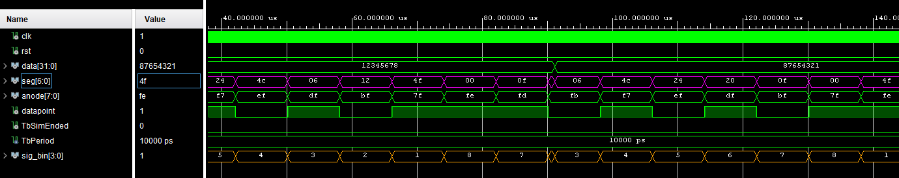

# Komponenta: `display_driver2`

Tato komponenta vychází z kódu vytvořeného na laboratorních cvičeních, ale je rozšířena pro obsluhu všech osmi sedmisegmentových displejů na vývojové desce. Zajišťuje tzv. časový multiplex – velmi rychlé přepínání mezi jednotlivými číslicemi, které lidské oko vnímá jako jeden souvislý statický obraz.

## Vstupy a Výstupy

| Port | Směr | Typ | Popis |
| :--- | :---: | :--- | :--- |
| **`clk`** | `in` | `STD_LOGIC` | Hlavní hodinový signál (Clock). |
| **`rst`** | `in` | `STD_LOGIC` | Synchronní reset. |
| **`data`** | `in` | `STD_LOGIC_VECTOR(31 downto 0)` | 32bitová vstupní data k zobrazení (8 číslic po 4 bitech). |
| **`seg`** | `out` | `STD_LOGIC_VECTOR(6 downto 0)` | Výstup pro jednotlivé segmenty displeje (A–G). |
| **`anode`** | `out` | `STD_LOGIC_VECTOR(7 downto 0)` | Výběr aktivní pozice displeje (anody). Aktivní v logické '0'. |
| **`datapoint`** | `out` | `STD_LOGIC` | Výstup pro desetinnou tečku (DP). Aktivní v logické '0'. |

## Princip fungování
[Zdrojový kód komponenty](../Vivado%20Project/DE1-Project-Stopwatch_VivadoProject/DE1-Project-Stopwatch_VivadoProject.srcs/sources_1/new/display_driver2.vhd)

Komponenta je založena na metodě časového multiplexování. Obsahuje děličku frekvence (`clk_en`), která generuje povolovací pulzy pro obnovovací frekvenci displeje, a tříbitový čítač (`counter2_bcd`), jenž neustále dokola počítá od 0 do 7.

Podle aktuálního stavu tohoto tříbitového čítače řídicí proces automaticky provádí tři úkony současně:

1. **Aktivace displeje:** Nastaví příslušný bit ve vektoru `anode` na logickou '0', čímž fyzicky zapne jeden konkrétní z osmi displejů.
2. **Směrování dat:** Vybere odpovídající 4 bity z 32bitového vstupu `data`. Tyto 4 bity pošle do subkomponenty dekodéru `bin2seg`, který je transformuje na signály pro rozsvícení správných segmentů číslice.
3. **Řízení teček:** Pevně definuje, zda má na dané pozici svítit desetinná tečka (`datapoint`). V této konkrétní implementaci svítí tečka na 3., 5. a 7. pozici, což slouží k optickému oddělení formátu času (oddělení hodin, minut, sekund a setin).

Díky rychlému střídání těchto 8 stavů se na displeji vykreslí kompletní 32bitové slovo.

## Simulace (Testbench)
[Zdrojový kód testbenche](../Vivado%20Project/DE1-Project-Stopwatch_VivadoProject/DE1-Project-Stopwatch_VivadoProject.srcs/sim_1/new/display_driver2_tb.vhd)

Testbench (`display_driver2_tb`) ověřuje funkčnost časového multiplexu a správné dekódování vstupních dat na segmenty a anody. Testuje následující **požadované funkce:**

1. **Test Resetu:** Během simulace se aktivuje signál `rst`. Ověřuje se, že komponenta přeruší zobrazování.
2. **Test zobrazení prvních dat:** Na vstup `data` je přivedena testovací hodnota `x"12345678"`. Testbench následně čeká dostatečně dlouhou dobu (80 µs), aby multiplexer stihl protočit všech 8 fází zobrazení. Během této doby lze v průbězích ověřit, že se každá anoda aktivuje ve správný čas se správným znakem.
3. **Test změny dat:** Hodnota na vstupu se skokově změní na `x"87654321"`. Opět se čeká celou periodu překreslení displeje, čímž se potvrdí, že komponenta správně a okamžitě reaguje na aktualizaci vstupních dat a překresluje displej podle nového zadání.

*(Obrázek: Průběh signálů ze simulace testbenche ukazující postupné střídání anod a segmentů v čase)*