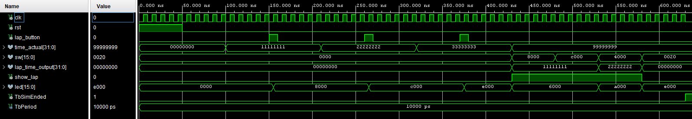

# Komponenta: `lap_ctrl`

Tato komponenta slouží jako paměť pro ukládání a prohlížení mezičasů (laps). Umožňuje uložit až 16 zaznamenaných časů a následně si je vyvolat na displej pomocí přepínačů. Zároveň ovládá soustavu LED diod, které vizuálně indikují zaplněná místa v paměti a blikáním upozorňují na právě prohlížený mezičas.

## Vstupy a Výstupy

| Port | Směr | Typ | Popis |
| :--- | :---: | :--- | :--- |
| **`clk`** | `in` | `STD_LOGIC` | Hlavní hodinový signál (Clock). |
| **`rst`** | `in` | `STD_LOGIC` | Synchronní reset. Vymaže celou paměť mezičasů a zhasne LED diody. |
| **`lap_button`** | `in` | `STD_LOGIC` | Tlačítko pro uložení aktuálního času do paměti (reaguje na log. '1'). |
| **`time_actual`** | `in` | `STD_LOGIC_VECTOR(31 downto 0)` | Aktuální čas stopek, který se má uložit. |
| **`sw`** | `in` | `STD_LOGIC_VECTOR(15 downto 0)` | Přepínače pro výběr a zobrazení konkrétního uloženého mezičasu. |
| **`lap_time_output`** | `out` | `STD_LOGIC_VECTOR(31 downto 0)` | Vybraný mezičas z paměti, který se pošle na displej. |
| **`show_lap`** | `out` | `STD_LOGIC` | Řídicí signál ('1' = chceme zobrazit uložený mezičas místo aktuálního času). |
| **`led`** | `out` | `STD_LOGIC_VECTOR(15 downto 0)` | Výstup pro LED diody (svítí = uloženo, bliká = právě zobrazeno). |

## Princip fungování

Komponenta se skládá ze tří hlavních logických bloků:

1. **Ukládání do paměti:** Uvnitř komponenty je vytvořeno pole o velikosti 16 (odpovídá počtu LED a přepínačů) 32bitových vektorů. Vnitřní ukazatel (`sig_write_ptr`) sleduje první volnou pozici. Jakmile přijde impulz z `lap_button`, hodnota z `time_actual` se zapíše na aktuální pozici a ukazatel se posune o jedna dál (maximálně však do 16).
2. **Čtení a zobrazení (Prioritní enkodér):** Pokud uživatel přepne některý z přepínačů `sw` nahoru, komponenta zkontroluje, zda je na dané pozici uložený platný čas. Přepínače jsou mapovány zleva doprava (SW15 ukazuje 1. mezičas, SW14 ukazuje 2. mezičas atd.). Vyhledávání má **prioritu zleva** – pokud je aktivních více přepínačů najednou, zobrazí se ten nejvíce vlevo. Po úspěšném výběru se čas pošle na výstup `lap_time_output` a logická 1 na `show_lap`. Pokus o zobrazení prázdného slotu je ignorován.
3. **Logika LED diod:** Komponenta neustále rozsvěcuje LED diody odpovídající uloženým mezičasům zleva doprava. Pomocí interních děliček (`clk_en` a `counter2_bcd`) je navíc generován 2Hz signál. Pokud je pomocí přepínače zobrazen konkrétní mezičas, jeho příslušná LED dioda začne s touto frekvencí blikat.

[Zdrojový kód komponenty](../Vivado%20Project/DE1-Project-Stopwatch_VivadoProject/DE1-Project-Stopwatch_VivadoProject.srcs/sources_1/new/lap_ctrl.vhd)

## Simulace (Testbench)
[Zdrojový kód testbenche](../Vivado%20Project/DE1-Project-Stopwatch_VivadoProject/DE1-Project-Stopwatch_VivadoProject.srcs/sim_1/new/lap_ctrl_tb.vhd)

Testbench (`lap_ctrl_tb`) testuje následující **požadované funkce:**

1. **Test uložení (Save):** Do vstupu `time_actual` jsou postupně nastaveny tři různé vymyšlené časy a pokaždé je simulován stisk tlačítka `lap_button`. Tím se uloží první tři mezičasy.
2. **Test čtení (Read):** Zapne se přepínač `sw(15)` (nejvíce vlevo). Ověřuje se, že na výstupu je správně zobrazen 1. uložený čas a signál `show_lap` je aktivní.
3. **Test priority:** K zapnutému `sw(15)` se přidá ještě `sw(14)`. Výstup se nesmí změnit, protože levý přepínač má přednost. Až po vypnutí `sw(15)` systém správně přepne na zobrazení 2. mezičasu.
4. **Test prázdného slotu:** Aktivuje se přepínač pro pozici, která nebyla uložena (např. 10. mezičas). Testuje se, že komponenta nepovolí zobrazení prázdných dat (signál `show_lap` zůstane '0').

*(Obrázek: Průběh signálů ze simulace testbenche ukazující ukládání do paměti a reakci na přepínače)*