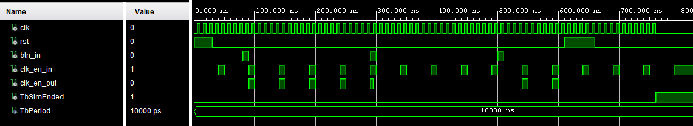

# Komponenta: `stopwatch_ctrl`
Funguje jako řídící jednotka pro `time_counter`. Vypíná a zapíná tok clock signálu clock_en zformovaného na 100 Hz. 
## Vstupy a Výstupy
| **Port** | **Směr** | **Typ** | **Popis** |
| :-: | :-: | :-- | :-- |
| `clk` | in  | `std_logic` | Hlavní hodinový signál (Clock). |
| `rst` | in  | `std_logic` | Synchronní reset. Pokud je '1', vynuluje všechno. |
| `btn_in` | in  | `std_logic` | Dává signál k změně operace. |
| `clk_en_in` | in | `std_logic` | Clock signál ustředěný na 100 Hz |
| `clk_en_out` | out | `std_logic` | Clock signál ustředěný na 100 Hz |

## Princip fungování
[Zdrojový kód komponenty](../Vivado%20Project/DE1-Project-Stopwatch_VivadoProject/DE1-Project-Stopwatch_VivadoProject.srcs/sources_1/new/stopwatch_ctrl.vhd)

Po stisku `BTNL` začne propouštět clc_en signál do counteru nebo naopak přestane propouštět signál.

## Simualce (Testbench)
[Zdrojový kód testbenche](../Vivado%20Project/DE1-Project-Stopwatch_VivadoProject/DE1-Project-Stopwatch_VivadoProject.srcs/sim_1/new/stopwatch_ctrl_tb.vhd)

Testbench (`stopwatch_ctrl_tb`) testuje následující **požadované funkce:**

1. **Test spuštění (Start):** Počáteční stav po resetu je "zastaveno". Po simulovaném stisku tlačítka (`btn_in`) se stopky spustí. Ověřuje se, že výstup `clk_en_out` začne propouštět pravidelné povolovací pulzy ze vstupu `clk_en_in`.
2. **Test zastavení (Stop):** Následuje opětovný stisk tlačítka. Stopky se musí zastavit, což znamená, že výstup `clk_en_out` zůstane trvale v logické '0', ačkoli vstupní pulzy na `clk_en_in` stále běží.
3. **Test resetu za běhu:** Stopky jsou znovu spuštěny a během jejich chodu je aktivován signál `rst`. Kontroluje se, že reset okamžitě přeruší běh stopek a výstup trvale přejde do stavu '0'.

*(Obrázek: Průběh signálů ze simulace testbenche ukazující spouštění, zastavování a resetování propouštění povolovacího signálu)*
