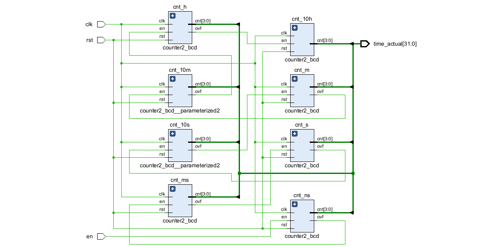
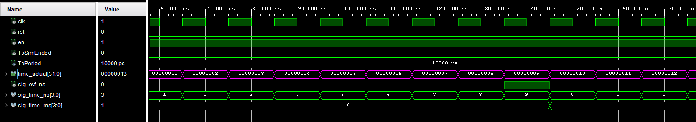

# Komponenta: `time_counter`

Tato komponenta funguje jako digitální časovač (stopky) využívající BCD (Binary-Coded Decimal) formát. Počítá čas od setin sekundy až po desítky hodin. Výstupem je 32bitový vektor  s aktuálním časem (složený z osmi 4bitových BCD číslic).
## Vstupy a Výstupy

| Port | Směr | Typ | Popis |
| :--- | :---: | :--- | :--- |
| **`clk`** | `in` | `STD_LOGIC` | Hlavní hodinový signál (Clock). |
| **`rst`** | `in` | `STD_LOGIC` | Synchronní reset. Pokud je '1', vynuluje všechny čítače. |
| **`en`** | `in` | `STD_LOGIC` | Povolení počítání (Enable). Čas běží pouze, pokud je '1'. |
| **`time_actual`** | `out` | `STD_LOGIC_VECTOR(31 downto 0)` | 32bitový výstup s aktuálním časem (složený z osmi 4bitových BCD číslic). |

## Princip fungování

Komponenta interně využívá kaskádové zapojení osmi menších čítačů ([`counter2_bcd`](../docs/counter2_bcd.md)). Každý z nich reprezentuje jeden řád času:

1. **Setiny a desetiny sekundy** (počítají 0–9)
2. **Jednotky a desítky sekund** (jednotky 0–9, desítky 0–5, tj. do 59)
3. **Jednotky a desítky minut** (jednotky 0–9, desítky 0–5, tj. do 59)
4. **Jednotky a desítky hodin** (počítají 0–9)

**Princip přenosu:** Jakmile nižší řád dosáhne svého maxima (např. setiny dosáhnou 9), vygeneruje signál přetečení (`ovf`). Tento signál zafunguje jako "enable" pro další řád v řadě (desetiny). Tímto způsobem se počítání kaskádově šíří až k hodinám.

Všechny čítače jsou nakonec sloučeny do jediného 32bitového vektoru `time_actual`, kde každé 4 bity (nibble) obsahují binární hodnotu jedné číslice.

## Schéma zapojení

*(Obrázek: Schéma zapojení kaskády čítačů)*

[Zdrojový kód komponenty](../Vivado%20Project/DE1-Project-Stopwatch_VivadoProject/DE1-Project-Stopwatch_VivadoProject.srcs/sources_1/new/time_counter.vhd)

## Simulace (Testbench)

Testbench (`time_counter_tb`) testuje nálsedující **požadované funkce:**

1. **Test Resetu:** Aktivuje se `rst` a ověřuje se, že na výstupu jsou samé nuly.
2. **Test počítání:** Do vstupu `en` je poslána rychlá série povolovací pulzů, aby se ověřilo, že se hodnoty správně přelévají z nižších řádů do vyšších.
3. **Test zastavení:** Vypne se signál `en` a kontroluje se, zda časovač přestal počítat a drží aktuální hodnotu.
4. **Test resetu při zastavení:** Znovu se aktivuje `rst` ve chvíli, kdy hodiny nepočítají, aby se potvrdilo korektní vynulování v klidovém stavu.

[Zdrojový kód testbenche](../Vivado%20Project/DE1-Project-Stopwatch_VivadoProject/DE1-Project-Stopwatch_VivadoProject.srcs/sim_1/new/time_counter_tb.vhd)

*(Obrázek: Průběh signálů ze simulace testbenche ukazující funkční přetečení do následujícího čítače, tj. bodd 2)*